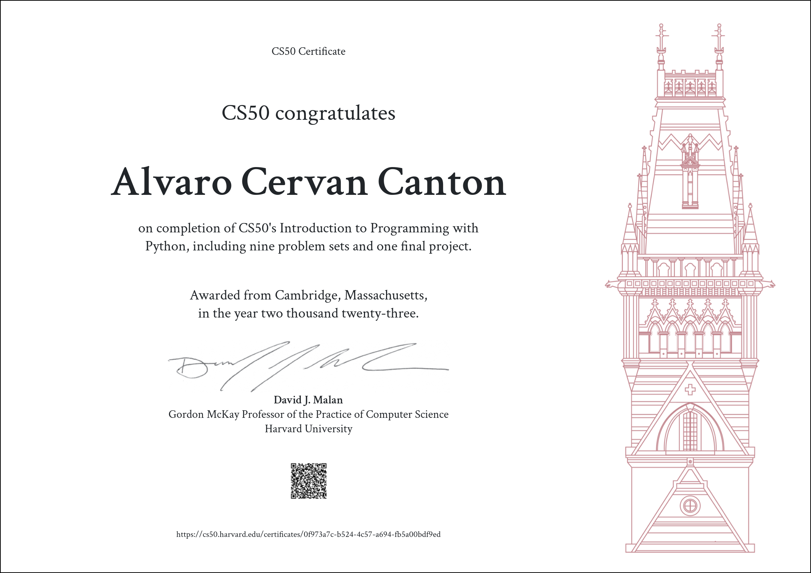

# CS50’s Introduction to Programming with Python

## Welcome

Here are all the tasks finished from CS50P. Each task passed the `CS50 check` and was submitted as of 2023.

  
|[Visit CS50P](https://cs50.harvard.edu/python/2022/)|[Final Project](Week%209)|[Certificate](https://cs50.harvard.edu/certificates/0f973a7c-b524-4c57-a694-fb5a00bdf9ed)|
|:-:	|:-:	|:-:	|

| Weeks | Topic                             | Problem Sets                                                                                                                                                                                                                                                                                      |
| :---: | --------------------------------- | ------------------------------------------------------------------------------------------------------------------------------------------------------------------------------------------------------------------------------------------------------------------------------------------------- |
|   0   | [Functions / Variables](Week%200) | [Indoor Voice](Week%200/indoor/indoor.py) - [Playback](Week%200/playback/playback.py) - [Faces](Week%200/faces/faces.py) - [Einstein](Week%200/einstein/einstein.py) - [Tip Calculator](Week%200/tip/tip.py)                                                                                      |
|   1   | [Conditionals](Week%201)          | [Deep Thought](Week%201/deep/deep.py) - [Home Federal Savings Bank](Week%201/bank/bank.py) - [File Extensions](Week%201/extensions/extensions.py) - [Math Interpreter](Week%201/interpreter/interpreter.py) - [Meal Time](Week%201/meal/meal.py)                                                  |
|   2   | [Loops](Week%202)                 | [camelCase](Week%202/camel/camel.py) - [Coke Machine](Week%202/coke/coke.py) - [ Just setting up my twttr](Week%202/twttr/twttr.py) - [Vanity Plates](Week%202/plates/plates.py) - [Nutrition Facts](Week%202/nutrition/nutrition.py)                                                             |
|   3   | [Exceptions](Week%203)            | [Fuel Gauge](Week%203/fuel/fuel.py) - [Felipe’s Taqueria](Week%203/taqueria/taqueria.py) - [Grocery List](Week%203/grocery/grocery.py) - [Outdated](Week%203/outdated/outdated.py)                                                                                                                |
|   4   | [Libraries](Week%204)             | [Emojize](Week%204/emojize/emojize.py) - [Frank, Ian and Glen’s Letters](Week%204/figlet/figlet.py) - [Adieu, Adieu](Week%204/adieu/adieu.py) - [Guessing Game](Week%204/game/game.py) - [Little Professor](Week%204/professor/professor.py) - [Bitcoin Price Index](Week%204/bitcoin/bitcoin.py) |
|   5   | [Unit Tests](Week%205)            | [Testing my twittr](Week%205/test_twttr/test_twttr.py) - [Back to the Bank](Week%205/test_bank/test_bank.py) - [Re-requesting a Vanity Plate](Week%205/test_plates/test_plates.py) - [Refueling](Week%205/test_fuel/test_fuel.py)                                                                 |
|   6   | [File I/O](Week%206)              | [Lines of Code](Week%206/lines/lines.py) - [Pizza Py](Week%206/pizza/pizza.py) - [Scourgify](Week%206/scourgify/scourgify.py) - [CS50 P-Shirt](Week%206/shirt/shirt.py)                                                                                                                           |
|   7   | [Regular Expressions](Week%207)   | [NUMB3RS](Week%207/numb3rs/numb3rs.py) - [Watch on YouTube](Week%207/watch/watch.py) - [Working 9 to 5](Week%207/working/working.py) - [Regular, um, Expressions](Week%207/um/um.py) - [Response Validation](Week%207/response/response.py)                                                       |
|   8   | [OOP](Week%208)                   | [Seasons of Love](Week%208/seasons/seasons.py) - [Cookie Jar](Week%208/jar/jar.py) - [CS50 Shirtificate](Week%208/shirtificate/shirtificate.py)                                                                                                                                                   |
|   9   | [ET Cetera](Week%209)             | [Final Project](Week%209/project)                                                                                                                                                                                                                                                                 |
